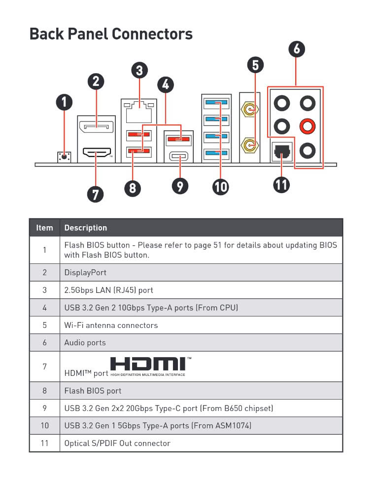

After setting up a Hackintosh on QEMU to debug my iPhone, I have tried to
redirect the USB to QEMU. But it just won't work. They suggests me to purchase
a PCIe to USB card, but that's not the most inexpensive option and the PCIe
slots on my motherboard were already occupied by the graphics card.

Luckily, USB connectors on the back panel of recent AMD motherboard are
physically separated into different devices. In particular, my MAG B650M MORTAR
WIFI (MS-7D76) has three PCIe devices corresponding to different cluster of
back panel USBs.

The port marked 8 per se is a PCIe device. The other two ports marked 4 are in
the same device. The rest USB ports including front panel are connected to a
single PCIe USB hub.

(This was figured out by plug a thumb drive into each port and run `lsusb`.
Perhaps the reason behind this separation is that port 8 is the Flash BIOS
port?)

## PCIe passthrough

tbd
